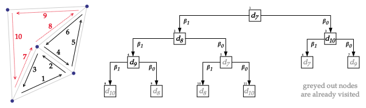
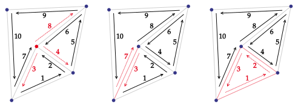

# Cell representation

---

## Orbits

<figure style="text-align:center">
    
    <figcaption><i>2-map example and its components values.</i></figcaption>
</figure>

In our \\(2\\)-map example, applying \\(\beta_1\\) recursively to \\(d_1\\) makes us cycle through
darts \\(d_1\\), \\(d_2\\), \\(d_3\\), that belong to different edges. Applying \\(\beta_2\\)
to \\(d_6\\) makes us cycle between \\(d_6\\) and \\(d_8\\), both belonging to different faces.
This set of darts accessible from a starting dart via a given \\(\beta_i\\) function is called
**orbit**.

> **Definition**: Orbit
>
> We call **orbit of \\(d\\) by \\( \lbrace f_1, f_2, ..., f_k \rbrace \\) and denote
> \\( \langle f_1, f_2, ..., f_k \rangle (d)\\)** the set of darts retrievable from \\(d\\) using
> any composition of \\(f_1, f_2, ..., f_k\\), including recursions. In other words,
> \\( \langle f_1, f_2, ..., f_k \rangle (d)\\) refers to the set of darts connected to
> \\(d\\), via the \\(f_1, f_2, ..., f_k\\) functions.
>
> The set is obtained by doing a Breadth First Search algorithm from the starting dart \\(d\\),
> where each connected node is the image of the current dart via one function
> \\(f \in \lbrace f_1, f_2, ..., f_k \rbrace\\). The order in which nodes are explored is
> determined by the order of the function set. 

For example, the orbit \\(\langle \beta _2 \rangle (d)\\) refers to the subset of unique darts
accessible from dart \\(d\\) using any composition of \\(\beta_2\\), including recursive ones.
The orbit \\(\langle \beta_1, \beta_0 \rangle (d_7)\\) refers to darts accessible from dart
\\(d_7\\) using any composition of \\(\beta_1\\) and \\(\beta_0\\). The computation process is
detailed below.

<figure style="text-align:center">
    
    <figcaption><i>Orbit computation BFS.</i></figcaption>
</figure>

## \\(i\\)-cells

Specific values of orbits can be used to define the cells commonly used in meshing algorithms.
These specific values are referred to as \\(i\\)-cells. For example the subset of dart defined by
\\( \langle \beta_1 \rangle (d)\\) corresponds to darts of a face, i.e., a \\(2\\)-cell. The subset
of dart defined by orbit \\( \langle \beta_2 \rangle (d)\\) corresponds to darts of an edge, i.e.,
a \\(1\\)-cell.

<figure style="text-align:center">
    
    <figcaption><i>0-cell, 1-cell, and 2-cell of d3.</i></figcaption>
</figure>

> **Definition**: \\(0\\)-cell
>
> Let \\(d \in D\\). The \\(0\\)-dimensional cell associated to dart \\(d\\) is
> \\( \langle { \beta_j \circ \beta_k, 1 \le j < k \le N } \rangle (d)\\).

> **Definition**: \\(i\\)-cell, \\(i \ne 0\\)
>
> Let \\(d \in D\\). The \\(i\\)-dimensional cell associated to dart \\(d\\) is
> \\(\langle \beta _1, ..., \beta _{i-1}, \beta _{i+1}, ..., \beta _N \rangle (d)\\).

Our interest lies in mesh representation, so we use these definitions applied to dimension 2 and 3.

| *i* | Geometry | 2-map                                            | 3-map                                      |
|-----|----------|--------------------------------------------------|------------ -------------------------------|
| 0   | Vertex   | \\( \langle \beta_1 \circ \beta_2 \rangle (d)\\) | \\(\langle \beta_1 \circ \beta_2, \beta_1 \circ \beta_3, \beta_2 \circ \beta_3 \rangle (d)\\) |
| 1   | Edge     | \\(\langle \beta_2 \rangle (d)\\)                | \\(\langle \beta_2, \beta_3 \rangle (d)\\) |
| 2   | Face     | \\(\langle \beta_1 \rangle (d)\\)                | \\(\langle \beta_1, \beta_3 \rangle (d)\\) |
| 3   | Volume   | -                                                | \\(\langle \beta_1, \beta_2 \rangle (d)\\) |
