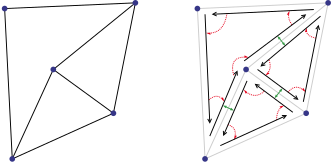
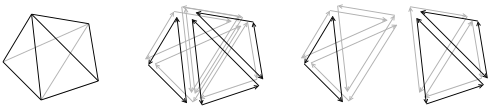

# Combinatorial maps

---

Combinatorial maps are combinatorial, graph-like, data structures which can be seen as the
formalization of half-edges to higher dimensions. They can be used in dimension two and three for
mesh representation, including both surface and volume 3D meshing.

Roughly speaking, a map is simply a set of abstract elements, called darts, augmented with functions defined on this set of darts, which describe topological relations between them. This section
presents the notions useful to understand maps, as they are the mai structure offered by the
library.

<figure style="text-align:center">
    
    <figcaption><i>Simple 2D mesh and its map representation.</i></figcaption>
</figure>

All of the definitions we present in this section are based on G. Damiand and P. Lienhardt
_Combinatorial Maps: Efficient Data Structures for Computer Graphics and Image Processing_;
The reader may refer to this book for more details.

<figure style="text-align:center">
    
    <figcaption><i>Simple 3D mesh and its map representation.</i></figcaption>
</figure>
