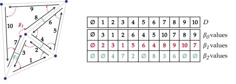
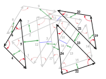
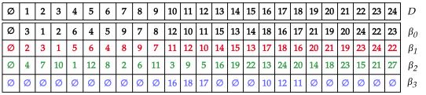

# Components

---

## Preliminary notions

Let \\(F, G\\) be finite sets of elements. Let \\(f\\) an application defined on \\(F\\) to \\(G\\).

> **Definition**: Permutation
>
> \\(f: F \rightarrow G\\) is a **permutation** if and only if \\(f\\) is a bijection and
> \\(F = G\\), i.e.,\\(f\\) is a one-to-one mapping from \\(F\\) to \\(F\\). 

> **Definition**: Involution
>
> \\(f: F \rightarrow F\\) is an **involution** if it is a permutation and is its own inverse, i.e.,
> \\(f\\) is a one-to-one mapping from \\(F\\) to \\(F\\), and \\(f = f^{-1}\\). 

Let \\(\emptyset\\) denote a null element. Let \\(F' = F \cup { \emptyset }\\).

> **Definition**: Partial permutation
>
> \\(f': F' \rightarrow F'\\) is a **partial permutation** if \\(f'(\emptyset) = \emptyset\\) and
> \\(\forall x,y \in F, f'(x) = f'(y) \ne \emptyset \Rightarrow x = y\\). 

> **Definition**: Partial involution
>
> \\(f': F' \rightarrow F'\\) is a partial involution if it is a partial permutation and
> \\(\forall x \in F, f'(x) = \emptyset\\) or \\(f'(x) \ne \emptyset \Rightarrow f'(f'(x)) = x\\). 

## Combinatorial maps

Let \\( N \in \mathbb{N} \\). An \\(N\\)-dimensional map is defined as follows:

> **Definition**: Combinatorial map
>
> \\(N\\)-dimensional combinatorial maps, or \\(N\\)-maps, are an \\((N+1)\\)-tuple
> \\((D, \beta_1, ..., \beta_N)\\) such that:
>
> - \\(D = \lbrace d_i \rbrace_i\\) is a finite set of darts,
> - \\(\forall j \in [ 1; N ], \beta_j\\) is a function from \\(D\\) to \\(D\\) defining
>   topology of the space. 

### Darts

Darts are the finest grain composing combinatorial maps. The structure of the map is given by the
relationship between darts, defined through beta functions. Additionally, a null dart is defined,
we denote it \\(d_0 = \emptyset\\).

In our implementation, darts exist implicitly through indexing and their associated data. There are
no dart *objects* in a strict sense, there is only a given number of dart, their associated data
stored using arrays, and a record of "unused" slots that can be used for dart insertion.
Because of this, we assimilate dart and dart index.

### Beta functions

Each combinatorial map of dimension *N* defines *N* beta functions linking the set of darts
together. These functions model the topology of the map, giving information about connections of
the different cells of the mesh. They verify the following properties:

- \\(\beta_1\\) is a partial permutation on \\(D\\).
- \\(\forall i \ge 2, \beta_i\\) is a partial involution on \\(D\\).
- \\(\forall i \in [1;N-2], \forall j \in [i+2; N], \beta_i \circ \beta_j\\) is a partial
  involution on \\(D\\).

Additionally, we define \\(\beta_0\\) as the inverse of \\(\beta_1\\).
This comes from a practical consideration for performances and efficiency of the implementation.

## Examples

<figure style="text-align:center">
    
    <figcaption><i>2-map example and its components values.</i></figcaption>
</figure>

<figure style="text-align:center">
    
    
    <figcaption><i>3-map example and its components values.</i></figcaption>
</figure>
