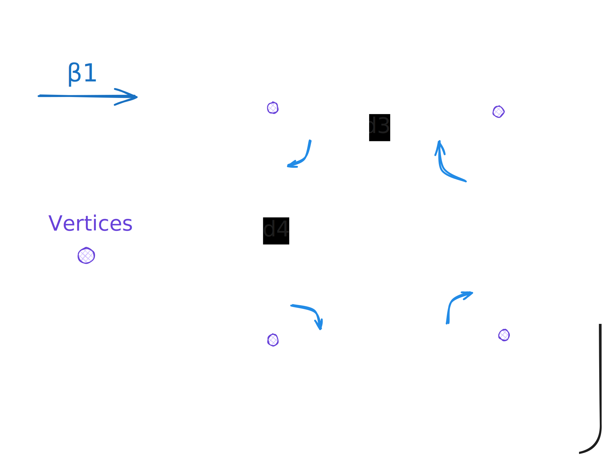
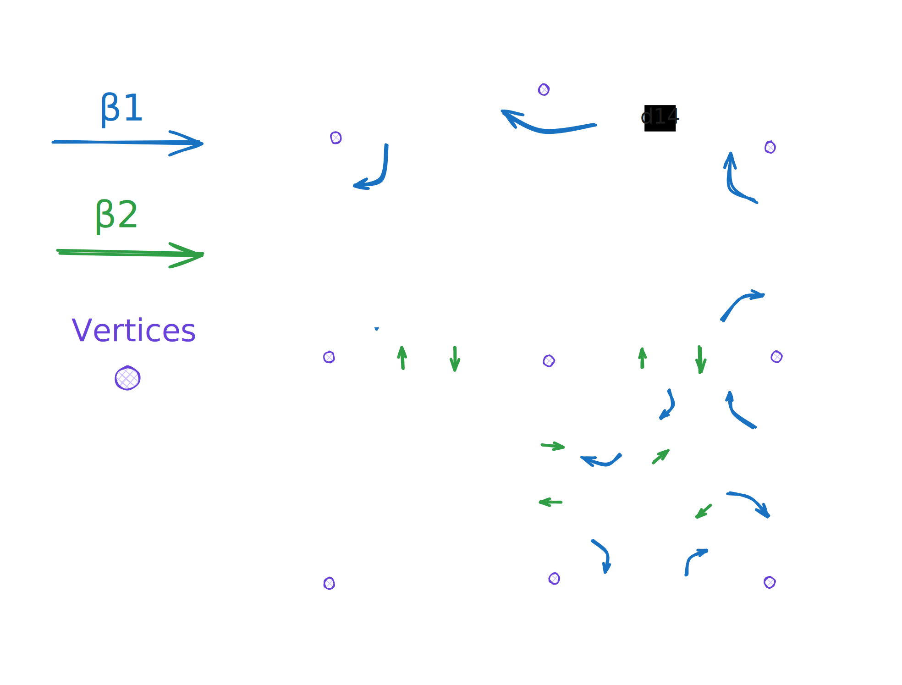

# Embedding

Embedding, or embedded data refers to the association of topological
entities (darts, *i*-cells) to geometrical data (spatial positions,
vertices, faces, volumes).

The embedding of geometrical data has implication for operations
on the map. This is detailed along operation specificities in their
dedicated sections.

## Implementation

Because embedding is defined per-application or per-needs, our combinatorial map implementation uses
a generic system to handle this; The storage follows our own specific logic, which is detailed in
[this](../../honeycomb_core/cmap/struct.CMap2.html#note-on-cell-identifiers) documentation entry.

## Examples

Note that darts and vertex IDs are not actually stored. Formers exist implictly
and latters are computed on the fly.

<figure style="text-align:center">
    
    <figcaption><i>Simple square representation</i></figcaption>
</figure>

In the above example, data would be organized like this:

| Storages             | 0    | 1          | 2          | 3          | 4          |
|----------------------|------|------------|------------|------------|------------|
| Darts                | null | d1         | d2         | d3         | d4         |
| Associated vertex ID | null | d1         | d2         | d3         | d4         |
| Vertices             | null | `0.0, 0.0` | `1.0, 0.0` | `1.0, 1.0` | `0.0, 1.0` |

<figure style="text-align:center">
    
    <figcaption><i>Larger representation</i></figcaption>
</figure>

In the above example, data would be organized like this:

| Storages             | 0    | 1          | 2          | 3          | 4          | 5    | 6          | 7    | 8    | 9    | 10         | 11   | 12   | 13   | 14         | 15         | 16         |
|----------------------|------|------------|------------|------------|------------|------|------------|------|------|------|------------|------|------|------|------------|------------|------------|
| Darts                | null | d1         | d2         | d3         | d4         | d5   | d6         | d7   | d8   | d9   | d10        | d11  | d12  | d13  | d14        | d15        | d16        |
| Associated vertex ID | null | d1         | d2         | d3         | d4         | d2   | d6         | d3   | d3   | d6   | d10        | d4   | d3   | d10  | d14        | d15        | d16        |
| Vertices             | null | `0.0, 0.0` | `1.0, 0.0` | `1.0, 1.0` | `0.0, 1.0` | null | `2.0, 0.0` | null | null | null | `2.0, 1.0` | null | null | null | `2.0, 2.0` | `1.0, 2.5` | `0.0, 2.0` |
