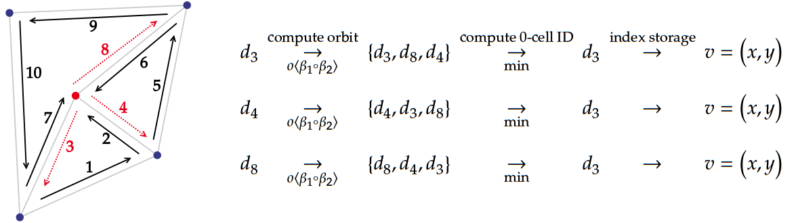

# Embedding

---

In order to use \\(N\\)-maps to represent meshes, we need to at least associate coordinates to
topological vertices (i.e. \\(0\\)-cells). The function that associates arbitrary data (referred to
as attributes) to \\(i\\)-cell is called the _embedding function_; It relates to the mathematical
notion of embedding and the existence of an injective, structure-preserving application between
two spaces.

> **Definition**: Embedding
>
> An **embedding of map \\(M\\) into \\(E\\)** is an application \\(f\\) from the set of cells of
> \\(M\\) onto \\(E\\) which preserve the structure of \\(M\\), i.e., each \\(i\\)-cell of \\(M\\)
> is associated with an \\(i\\)-dimensional part of \\(E\\) so that incident cells of \\(M\\) are
> associated to incident parts of \\(E\\). 

This is a very general definition which leaves a lot of room for implementation choices. We designed
our system with robustness in mind, as we found issues within attribute handling in existing
implementations (a lack of formalization surrounding attribute behavior, mostly).

Our implementation supports arbitrary attribute binding, provided that they are uniquely typed and
satisfy the trait constraints required by the attribute manager.

## Implementation

Because embedded data is defined per-application or per-needs, our combinatorial map implementation
uses a generic system to handle this. We do not store cell identifiers in collection, and instead
compute identifiers as needed for data access.  

<figure style="text-align:center">
    
    <figcaption><i>0-cell ID computation process for a 2-map.</i></figcaption>
</figure>

Identifiers are used to index specific attribute storages, which are distinguished using attribute
type signatures. This notably implies that all attributes must be uniquely typed. For more
information, consult the API documentation of the following items:
- `AttributeBind` trait,
- `AttributeUpdate` trait,
- `AttributeStorage` trait,
- `UnknownAttributeStorage` trait,
- `AttrStorageManager` struct (private, go to source code or use `--document-private-items` option).

All are defined in the `honeycomb_core::attributes` module.
