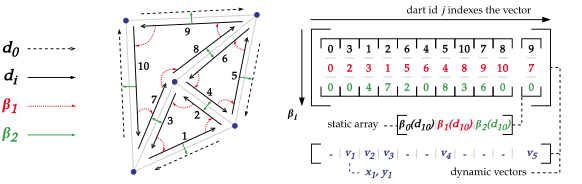

# Element insertion and deletion

---

Two main operations are defined to modify combinatorial maps, _sew_ and _unsew_. Four additional
operations are defined in order to construct maps.

One can increase or decrease dimension of a map, and add or remove darts from a map. Dimension
change corresponds to adding or removing a \\(\beta\\) function of the highest dimension, while
dart addition or deletion corresponds to adding or removing an element from \\(D\\).

## Dart insertion

In our implementation, darts exist implicitly through indexing of the internal storage structures
of the map. Because of this, adding darts translates to extending internal vectors and storages in
our implementation.

<figure style="text-align:center">
    
    <figcaption><i>2D map and its storage layout in memory.</i></figcaption>
</figure>

An internal counter is incremented at each dart addition. This, coupled with an unused dart
tracking mechanism, constitutes a way to keep track of attributed darts.

## Dart deletion

Removing a dart would technically require us to remove an entry inside storage structures, which
are ordered, contiguous vectors. There are two way to approach this problem:

- Actually remove the entry
    - requires adjustments on all the structure to keep consistent indices
    - keeps the storage compact, i.e. all allocated slots are used
- "Forget" the entry
    - does not require any re-arrangements besides making sure no beta functions lands on the dart
    - creates "holes" in the storage

Our implementation uses the second solution, along with a mark system for unused darts. In turns,
we can use these "holes" in the storage to reinsert new element or collapse the structure at a
later point during execution.

## Add / Remove a dimension

Adding or removing a dimension on a given combinatorial maps effectively corresponds, respectively,
to adding or removing a beta function. In the case of decreasing the dimension, this operation can
result in two disjoint dart set in the same map.

This is not implemented in the library as we haven't found any real use case for the operation.
If ever needed, it could be implemented using the `TryFrom` trait provided by the Rust language.
