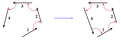
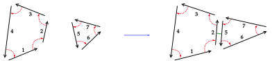
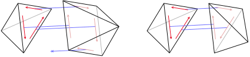
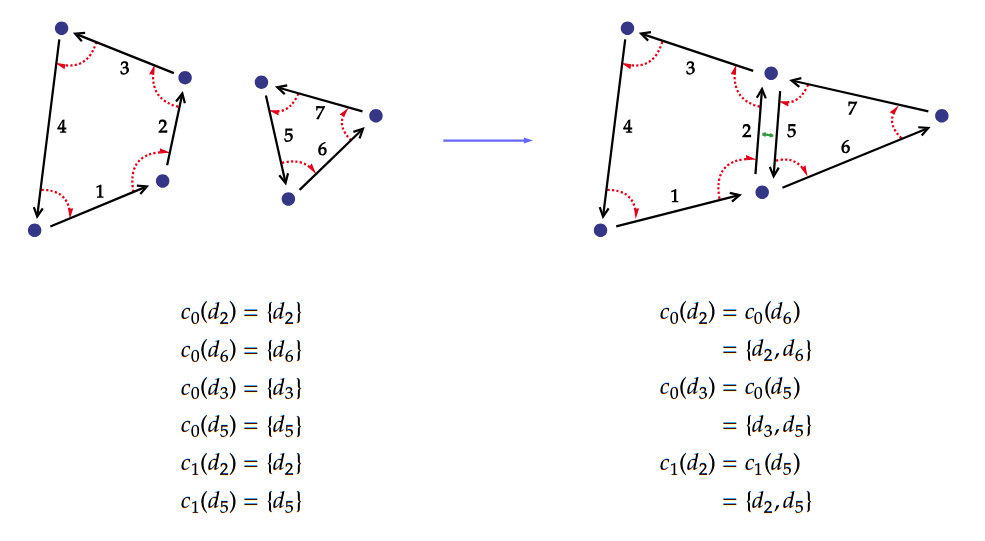

# Sewing operation

---

Sew and unsew operations update the beta function values to modify the topological relation between
two or more darts. An \\(i\\)-dimensional sew can be interpreted as creating a connection between
two \\(i\\)-dimensional cells. That connection takes the form of an adjacency, and the definition of
the operation ensures that local structure remains consistent (in particular,  cells incident to
the new adjacency).

We present a simplified overview of the operations here, as their formal definitions in
\\(N\\)-dimension do not really contribute to library understanding and usage.

## Sewing

The sew operation can be divided into two parts:

- a topological update, which corresponds to a \\(\beta\\) function update to model a new
  topological relation
- a geometrical update, which corresponds to an update of the affected embedded data (attributes)

We call \\(i\\)-link the sub-operation corresponding to the topological update; Our implementation
provide it along with sews due to performance and flexibility concerns.

### Topology

The \\(i\\)-link operation corresponds to the aforementioned topological update. Given two darts
\\(d_a\\) and \\(d_b\\), the \\(i\\)-link operation will update of the \\(\beta_i\\) function in
order to model the new connection(s).

<figure style="text-align:center">
    
    <figcaption><i>1-sew between d1 and d4.</i></figcaption>
</figure>

<figure style="text-align:center">
    
    <figcaption><i>2-sew between d2 and d5.</i></figcaption>
</figure>

The definition of the new \\(\beta_i\\) function depends on the dimension of the link; \\(1\\)-link
has a different definition than \\(i\\)-links, \\(i \ge 2\\).

The operation is valid only if the respective orbit of the two darts are mappable by a bijection;
In practice, this corresponds to a very intuitive condition illustrated below.

<figure style="text-align:center">
    
    <figcaption><i>Example of non 3-sewable (left) and 3-sewable (right) orbits.</i></figcaption>
</figure>

### Geometry

<figure style="text-align:center">
    
    <figcaption><i>Effect of 2-sew on i-cell composition.</i></figcaption>
</figure>

The *i-sew* operation corresponds to an *i-link* operation, coupled with an update of the affected
attributes. This update is necessary as the topological update can modify the composition 

 *How* the attributes are updated is defined through trait implementation in the Rust
crate (see [Embedding](embedding.md)). *Which* attributes are
updated can be deduced from the dimension \\(i\\) of the sewing operation. This is summarized in
the following table:

| Dimension | Geometrical operation | 0-cell / Vertex Attributes | 1-cell / Edge Attributes | 2-cell / Face Attributes | 3-cell / Volume Attributes |
|-----------|-----------------------|----------------------------|--------------------------|--------------------------|----------------------------|
| 1         | Fusing vertices       | affected                   | unaffected               | unaffected               | unaffected                 |
| 2         | Fusing edges          | affected                   | affected                 | unaffected               | unaffected                 |
| 3         | Fusing faces          | affected                   | affected                 | affected                 | unaffected                 |

## Unsewing

The unsew operation is the inverse to the sew operation. It behaves according to similar
properties, but is used to remove links between darts. It does so by replacing values of the
\\(\beta\\) functions by the null dart. Geometrical updates are handled and defined in the same
way as for the sew operation.

It also affects attributes similarly, but incident cells are split instead of merged.
