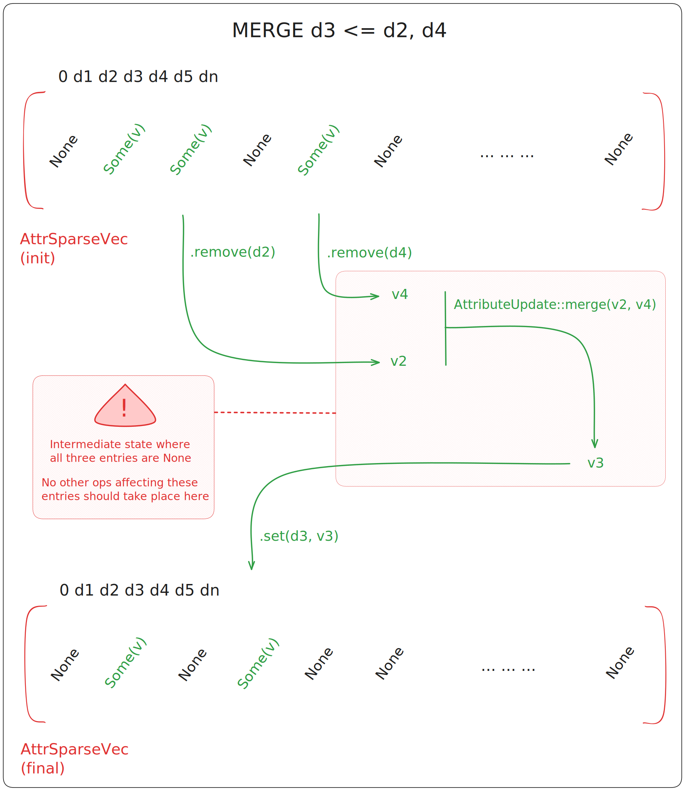

# Transactional memory

**This content has been copy-pasted from the previous guide. It is up-to-date but should be improved
at some point.**

---

## Needs

Rust's ownership semantics require us to add synchronization mechanism to our structure if we want
to use it in concurrent contexts. Using primitives such as atomics and mutexes would be enough to
get programs to compile, but it would respectively yield an incorrect or impractical implementation:

- Atomics give guarantees on instructions interleaving for a single given variable, they do not give
  any guarantees for instructions affecting different atomic variables.
- Mutexes (and similar locks, e.g. RWLocks) can be used to create guarantees when accessing multiple
  variable: for example, we can write an operation that does not progress until all of the used data
  is locked. However, locks are error-prone, have very poor composability.

The nature of meshing operations makes both mechanisms very unpractical. They are complex, access
many variables, and are often comprised of multiple steps. For example, the following operation is
executed on all affected attributes of a sew:

<figure style="text-align:center">
    
    <figcaption><i>Attribute merging operation. This occurs at each sew operation.</i></figcaption>
</figure>

Because the map can go through invalid intermediate states during a single operation, we need to
ensure another thread will not use one of these as the starting point for another operation. This
rules out fine-grained atomics.

The sew operation is the main method used to create new connectivities in the map. This means that
most high-level meshing operations will call this method multiple times. If these meshing operations
require locking all of the variables to ensure correct execution, the locks must be returned or
exposed to the user so that he can unlock them at the right time. Manual lock management is
error-prone, and becomes impossible in practice for complex meshing operations.

## Software Transactional Memory

We choose to use Software Transactional Memory (STM) to handle high-level synchronization of
the structure. Unlike locks, STM has great composability and allows users of the crate to easily
define pseudo-atomic segments in their own algorithms.

Exposing an API that allows users to handle synchronization also means that the implementation
isn't bound to a given parallelization framework. Instead of relying on predefinite parallel
routines (e.g. a provided `parallel_for` on given cells), the structure can be used to implement
existing algorithms regardless of their approach (data-oriented, task-based, ...).
