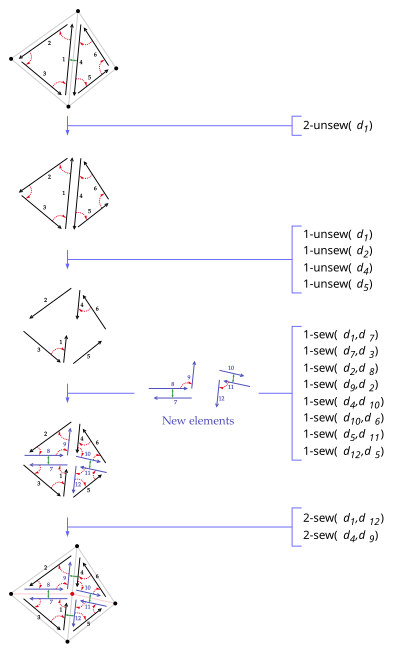
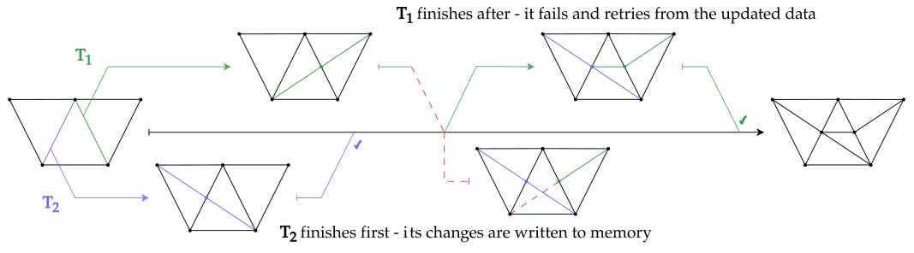

# Transactional memory

---

Meshing operations demand guarantees for coordinated access across sets of variables. They may also
be composed of multiple steps that should not be interrupted, or where intermediate mesh state may
be invalid.

<figure style="text-align:center">
    
    <figcaption><i>Edge cut operation with detailed steps.</i></figcaption>
</figure>

For example, an edge cut in a triangular mesh is defined by the insertion of a vertex on
an existing edge, before the creation of two new edges that cut across the original adjacent
triangles. After the first vertex insertion, and before both edges creation, the mesh actually
contains quadrangular cells. This is a state that should not be visible to other threads, nor should
it be a final state.

## Needs

In order to guarantee validity, we must ensure that these intermediate, incorrect states aren’t
used by another thread to compute an erroneous result, i.e., that all changes made in a thread
appear at once to others. To obtain our final system, we worked incrementally on a synchronization
policy choice. 

Rust's ownership semantics require us to add synchronization mechanism to our structure if we want
to use it in concurrent contexts. Using primitives such as atomics and mutexes would be enough to
get programs to compile, but it would respectively yield an incorrect or impractical implementation:

- Atomics give guarantees on instructions interleaving for a single given variable, these guarantees
  cannot be extended to a set of accesses across different variables.
- Mutexes (and similar locks, e.g. RWLocks) can be used to implement greater synchronization
  coordination: for example, we can write an operation that does not progress until all of the used
  data is locked. However, locks are error-prone, have very poor composability. Issues that come
  with those grow along the number of locks used.

## Software Transactional Memory

We choose to use Software Transactional Memory (STM) to handle high-level synchronization of
the structure. Unlike locks, STM has great composability and allows users of the crate to easily
define pseudo-atomic segments in their own algorithms.

<figure style="text-align:center">
    
    <figcaption><i>Edge cut operation with detailed steps.</i></figcaption>
</figure>

Exposing an API that allows users to handle synchronization also means that the implementation
isn't bound to a given parallelization framework. Instead of relying on predefinite parallel
routines (e.g. a provided `parallel_for` on given cells), the structure can be used to implement
existing algorithms regardless of their approach (data-oriented, task-based, ...).
