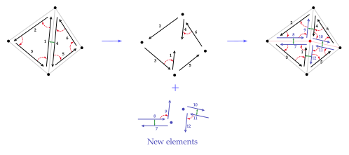
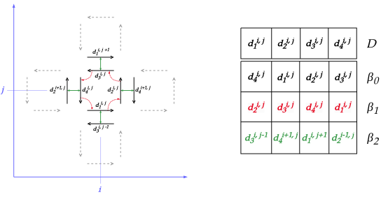
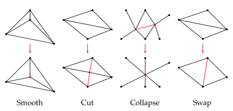

# Applications

---

The `applications` crate contains multiple binaries which serve as benchmarks and examples for the
library. The following targets are defined:

| Algorithm                            | Target binary          | Dimension |
| ------------------------------------ | ---------------------- | --------- |
| Delaunay triangulation               | `incremental-delaunay` | 3D        |
| Edge cut                             | `cut-edges`            | 2D        |
| Overlay grid (intersection-based)    | `grisubal`             | 2D        |
| Overlay grid (refinement-based)      | `overlay-grid`         | 2D        |
| Parameterized grid generation        | `generate-grid`        | 2D and 3D |
| Polygon triangulation                | `triangulate`          | 2D        |
| Remeshing pipeline proxy-application | `remesh`               | 2D        |
| Vertex smooth                        | `shift-vertices`       | 2D        |

Most algorithms work on 2D meshes because the structure was implemented first in 2D. Nonetheless,
the 3D structure is just as polished, and the 3D Delaunay triangulation was the most consequential
algorithm in our optimization process as it highlighted issues that did not appear in 2D.

Each binary has a documented CLI, which can be printed using the `--help` option. Outputs can be
serialized, and, if the `render` feature is enabled, the output mesh will be displayed at the end
of the execution.

## Delaunay triangulation

This is a 3D incremental Delaunay triangulation implementation. It roughly follows the algorithm
presented in _One machine, one minute, three billion tetrahedra_, Marot et al, 2019. We do not
implement boundary recovery, and focus on the benchmarking aspect by sampling point in a box-shaped
domain and inserting them into a first basic triangulation.

## Edge cut

This algorithm apply a basic edge cut operation to all edges of the mesh until a target length is
reached. 

<figure style="text-align:center">
    
    <figcaption><i>Edge cut operation. This can be applied to boundary edges, using only three new darts.</i></figcaption>
</figure>

## Overlay grid

### Intersection-based

This mesh generation algorithms uses intersection with an overlaid grid to create a triangular mesh
of a geometry passed as input. 

### Refinement-based

This mesh generation algorithms uses incremental refinement of an octree and its dualization to
create an hexahedral mesh of the input geometry.

## Parameterized grid generation

This is a grid generation algorithm for our structure, i.e., mesh instantiation with pre-definite
values representing a grid.

<figure style="text-align:center">
    
    <figcaption><i>Dart indexing logic in generated 2D grids. The same approach is applied to 3D grids.</i></figcaption>
</figure>

Elements of the grid can be indexed in a systematic manner. Thanks to this, we implemented an
efficient parallel version of this algorithm, as well as a GPU version which outperforms the
parallel CPU one. We use the [`cudarc`](https://github.com/chelsea0x3b/cudarc) crate to offload
the value generation to the GPU.

## Polygon triangulation

This algorithm allows triangulation of simple 2D polygon using one of two methods:
[ear-clipping](https://en.wikipedia.org/wiki/Polygon_triangulation#Ear_clipping_method) or
[fanning](https://en.wikipedia.org/wiki/Fan_triangulation). The binary triangulates the entire
mesh input, while `honeycomb-kernel` provides the routine call used to triangulate a single cell.

## Remeshing pipeline proxy-application

This algorithm is a proxy-application for very common remeshing workflow found in triangle or
tetrahedron meshing. Multiple meshing kernels are applied in a loop until a certain predicate is
satisfied, or for a given number of rounds.

<figure style="text-align:center">
    
    <figcaption><i>Remeshing loop structure.</i></figcaption>
</figure>

## Vertex smooth

We implement two parameterized smoothing algorithm: Laplace smoothing and Taubin smoothing. A
current work in progress includes a GPU-based Jacobi smoother using a Rust-Kokkos interoperability
library.
