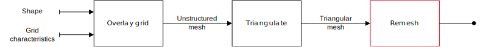

# Remeshing routines

---

Remeshing pipeline are comprised of multiple phases, each having their own operation type. We group the implementation
of such routines in [this](../../honeycomb_kernels/remeshing/index.html) module.

<figure style="text-align:center">
    
    <figcaption><i>2D remeshing pipeline</i></figcaption>
</figure>

## Vertex relaxation

- `move_vertex_to_average` -- move a vertex to the average position of a passed list (in the case of our pipeline, its
  neighbors).
- `dvr` -- not yet implemented (https://github.com/LIHPC-Computational-Geometry/honeycomb/pull/212)

## Cell division

The functions below use routines defined in the [cell insertion](../../honeycomb_kernels/cell_insertion/index.html)
module.

- `cut_inner_edge` / `cut_outer_edge` -- cut an edge in half and build triangles from the new vertex

## Cell fusion

- `collapse_edge` -- collapse an edge of the mesh, fusing connectivities of vertices on both ends to a single, new
  vertex

## Cell edition

- `swap_edge` -- tip over an edge shared by two triangles

## Quality

- `compute_face_skewness_2d` / `compute_face_skewness_3d` -- compute the [skewness][SKW] of a given face.

[SKW]: https://ansyshelp.ansys.com/public/account/secured?returnurl=//////Views/Secured/corp/v242/en/wb_msh/msh_skewness.html
