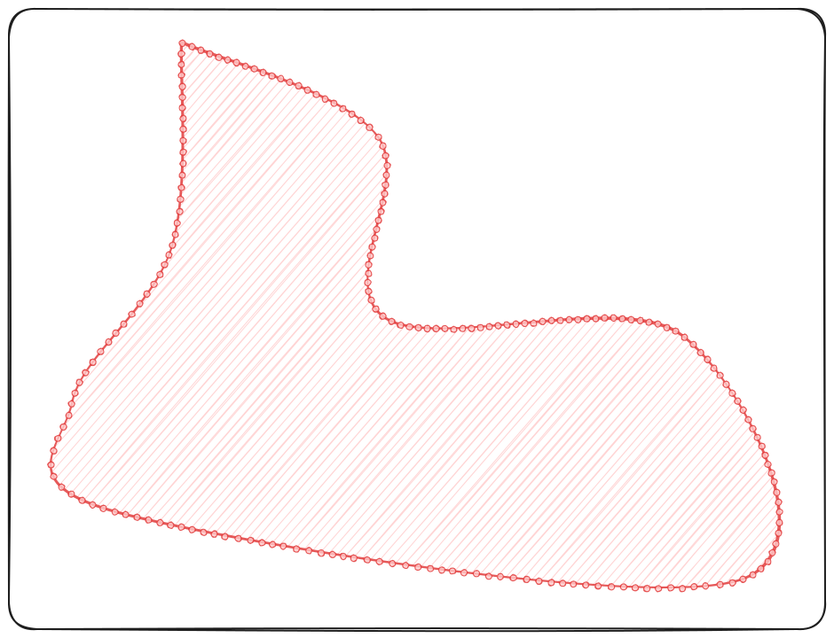
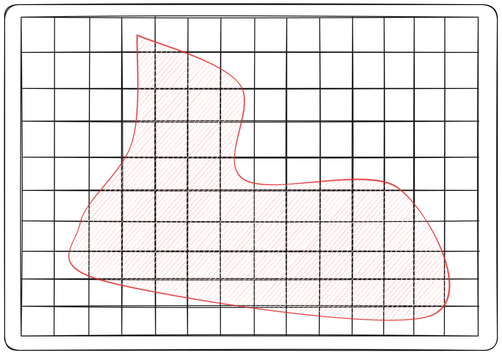
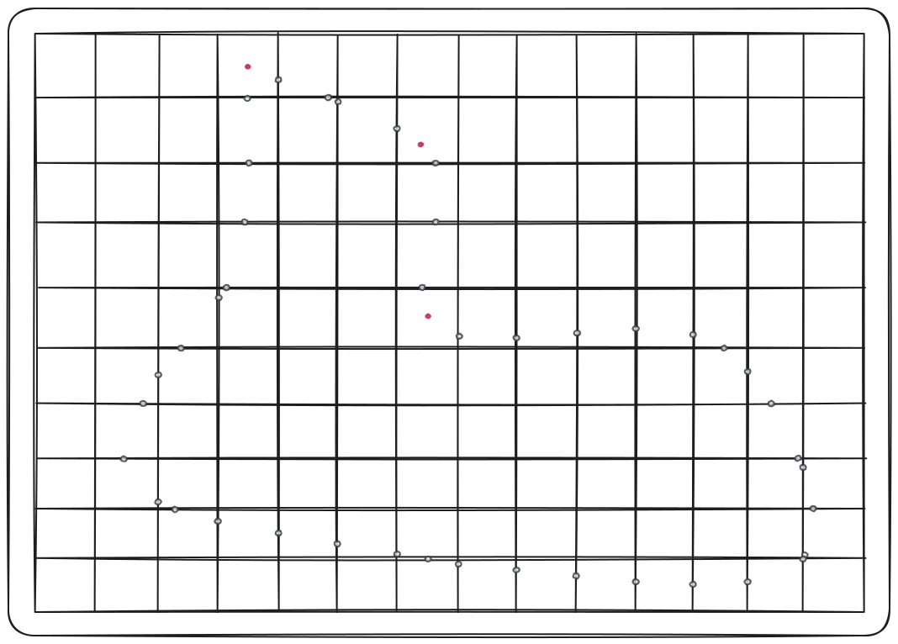
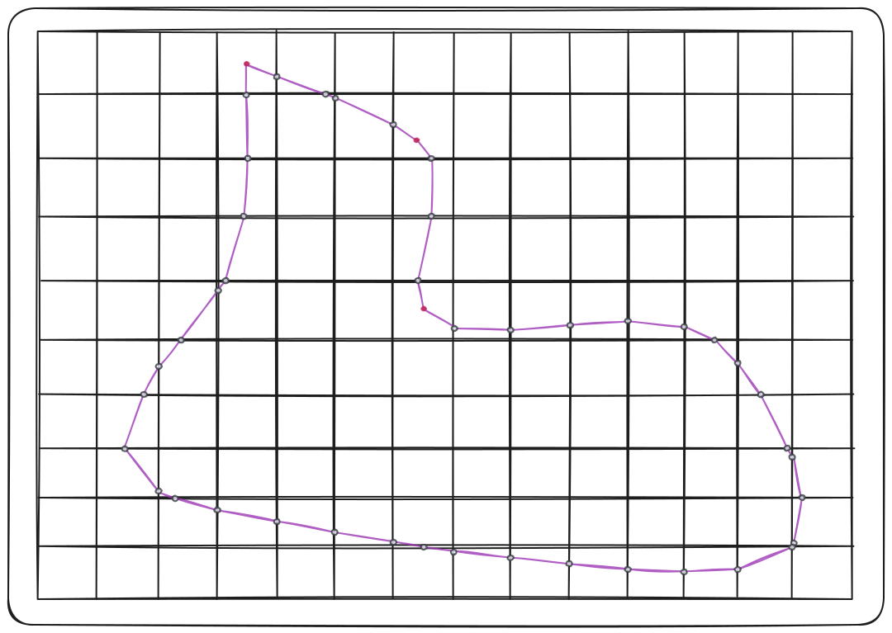
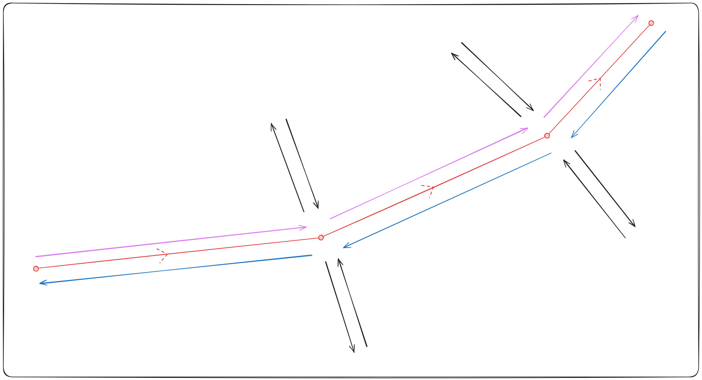
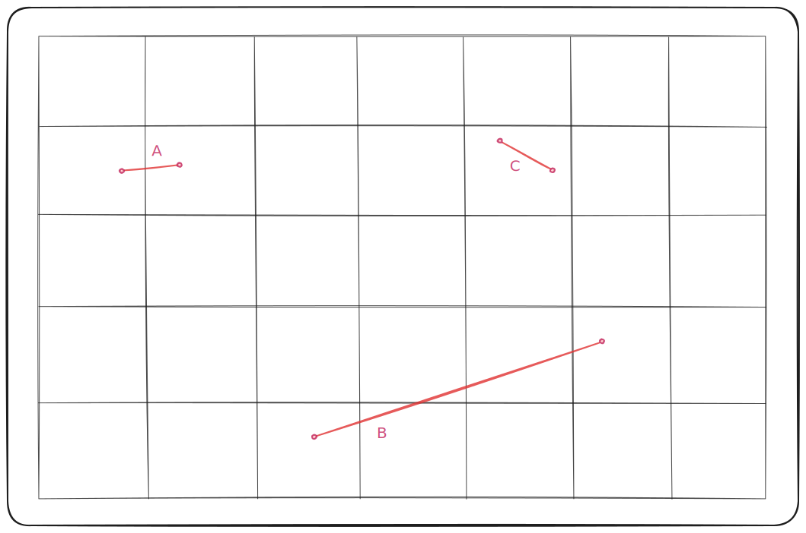
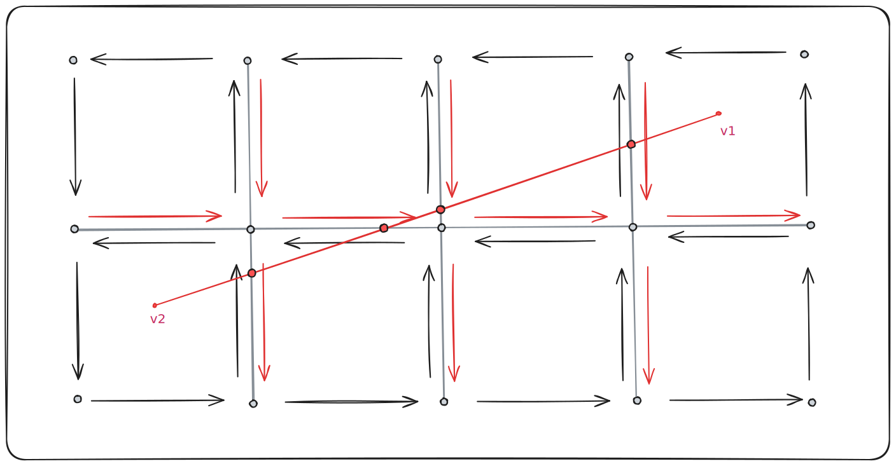
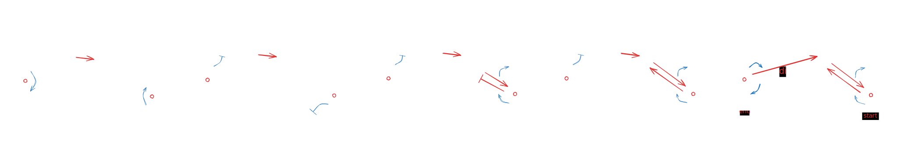

# honeycomb-kernels - GRISUBAL

---

**Grisubal** is a mesh generation algorithm inspired by [Morph][IMR-RN]. The mesh is built by capturing
the input geometry in an overlapping grid, by first computing intersection vertices and then rebuilding
boundaries from the captured vertices.

The algorithm can be called using [this](../honeycomb_kernels/grisubal/fn.grisubal.html) function.

[IMR-RN]: https://internationalmeshingroundtable.com/assets/research-notes/imr32/2011.pdf

---

## Input

The algorithm expects a (2D) geometry specified via a path to a VTK legacy file. The geometry's boundaries should be
described via segments & vertices; Segments should be *consistently oriented*.

<figure style="text-align:center">
    
    <figcaption><i>Finely segmented input geometry</i></figcaption>
</figure>

Some vertices can be explicitly listed as cells in order for the algorithm to interpret those as *Points of Interests*.
This can be used to ensure irregular geometries are captured correctly by the algorithm, which uses a uniform grid size.

## Geometry Pre-processing

Before running the main algorithm, a few steps are followed to ensure correctness of later computations.

First, we compute the characteristics of a grid overlapping the entire geometry. The origin is automatically computed 
according to the input geometry and the desired cell sizes; It is then, if necessary, adjusted to avoid a few edge 
cases that would create issues in the main algorithm.

After grid characteristics are obtained, they're used along the geometry to detect and remove redundant Points of 
Interest. These are defined as PoI that land exactly on the grid; Their removal is necessary to avoid creating duplicate
vertices in the main algorithm (since there would be both an intersection and a PoI at this location).

As a last step before calling the main kernel, we check for trivial orientation issues by ensuring no vertex is the 
start (resp. the end) of two different segments. This detects inconsistencies per-boundary, not overall consistency.

## Grid Submersion Algorithm

### Step 1 - Intersect Grid & Geometry

The goal of this step is to edit and complete the segment list to obtain a list of non-dividable segments that can be
used for reconstruction at a later step. Consider the previous geometry, submerged in an overlapping grid:

<figure style="text-align:center">
    
    <figcaption><i>Input geometry with its overlapping grid</i></figcaption>
</figure>

We check each segment of the geometry for intersection(s) with the grid, and replace the original segment with new
ones given the result of the check. A [dedicated section](#intersection-computation) goes over the method we use,
these are the rough cases:

- **Both vertices belong to the same cell**: the new segment is the same as the original.
- **Vertices belong to neighboring cells**: there are two new segments, first from start vertex to intersection, second
  from intersection to end vertex.
- **Vertices belong to different non-neighboring cells**: there are *d* new segments, first from start vertex to
  intersection, then between intersections, last from intersection to end vertex.

Intersection information is collected and returned along with the list of non-dividable segments. The information is
made up of a dart identifier (the intersected dart) as well as the relative position of the intersection on this dart
(a floating-point `t` between `0` and `1`).

At the same time, vertices are labeled as one of three types: `Regular`, `PoI`, or `Intersec`. This is used by the
processing logic of the next steps.

### Step 2 - Insert Intersection Vertices

Intersection information is sorted **per intersected edge** for processing and mapped back to its initial storage.

The workflow follows these steps:
- Group intersection data per edge
- Adjust the relative position value to match the edge's direction instead of the dart's
- Per edge:
    - Sort intersections by relative position along the edge (required for correct insertion)
    - Insert the vertices / darts (call to `CMap2::splitn_edge`)
- Link back the inserted darts to their corresponding intersection

There are two main reasons for this step to exist as its own:
- Algorithm modularity; By having a dedicated section to process intersections, we can more easily introduce more
  intersection variants (corners? tangents?).
- Handling cases where a single edge is intersected multiple time by the geometry; Since we assume that we're
  intersecting one of the grid's original dart, we can't insert vertices on the fly without creating issues related to
  execution path.

### Step 3 - Filter & Rebuild Segment Data

Given the list of segments computed during the previous step, we must rebuild new segments where both ends are either
points of interest or intersections. This corresponds to building segments using the following vertices:

<figure style="text-align:center">
    
    <figcaption><i>Intersection vertices (gray) & points of interest (red)</i></figcaption>
</figure>

This can be done in two substeps:

1. Filter segments by starting vertex to only keep intersections;
2. For each of these segments, follow through until landing on another intersection; While searching through, keep
   track of any PoI encountered.

Using a set of data made up of starting intersection, ending intersection, and (optional) intermediates, we can build
edges into the final 2-map.

### Step 4 - Insert Segments

Given the data built up at the last step, we can proceed with insertion into the map. At this point, only darts linking
the first intersection to the following vertex need to be added to the map.

The main work consist of fetching correct dart identifiers and update the topology by using link and sew methods. By
following this process recursively for intermediates, we can build the final map, capturing the geometry's boundaries:

<figure style="text-align:center">
    
    <figcaption><i>Captured geometry</i></figcaption>
</figure>

## Clipping

Optionally, some cells of the resulting combinatorial map can be removed. These cell would correspond to the inside or
the outside of the geometry. We choose to simply consider the *left* side and the *right* side of the boundary, to 
minimize orientation assumptions and avoid confusion.

<figure style="text-align:center">
    
    <figcaption><i>
        Boundary sides. The oriented geometry is in red, left side in purple, right side in blue.
    </i></figcaption>
</figure>

During the last step of the main algorithm, darts of the boundary are marked according to their respective side. From
this, we can retrieve faces of a given side, and use them as a starting point for a coloring-like algorithm. 

Faces are searched and marked using a BFS; only adjacent faces with an unmarked dart are considered. If, at any point, 
a face with a dart of the other side of the boundary is reached it means that:
- the geometry was open, or
- nested boundaries are inconsistently oriented.

After this, all darts of the marked faces are deleted. The attribute used to mark boundary darts is then removed from 
the map before it is returned.

## Appendices

### Intersection Computation

Consider a given segment of the geometry. Each of the segment follow one of three cases:

<figure style="text-align:center">
    
    <figcaption><i>Intersection types</i></figcaption>
</figure>

- `A` - Vertices belong to neighboring cells.
- `B` - Vertices belong to different non-neighboring cells.
- `C` - Both vertices belong to the same cell.

We can identify which case we're in by computing the Manhattan distance between grid cells of the respective vertices:

- `A` - Distance is equal to `1`.
- `B` - Distance is strictly superior to `1`.
- `C` - Distance is `0`.

The `A` case is pretty straight forward: By considering that the segment is oriented from
the start to its end, we can deduce which side of the cell it's intersecting, and compute the relative position of the
intersection `t`:

<figure style="text-align:center">
    
    <figcaption><i>Intersection at the scale of a single cell</i></figcaption>
</figure>

The `B` case is trickier to handle because we need to compute multiple intersections, and know their order to be able
to build the segment back into the map.

<figure style="text-align:center">
    
    <figcaption><i>Repeated intersections with the grid</i></figcaption>
</figure>

By considering the minimal subgrid containing both vertices, as well as the direction of the segment, we can list all
edges that are potentially intersected.

We can compute coefficients `s` and `t` for each of the potentially intersected segments. If the segment is actually
intersected, both coefficients will have a value between `0` and `1`. `s` being the relative position of the
intersection along the original segment, we can use its value to reorder all valid intersections for segment building.

### Insertion Logic

For a given instance of data containing:

- a starting dart: *dstart*
- (optional) one or more intermediate darts: *{ di } i*
- an ending dart: *dend*

These steps are followed:

- `1-unsew` *dstart*
- `0-unsew` *dend*, i.e. `1-unsew` *β0 (dend)*
- create a pair of dart & link it via *β2*
- `1-sew` *dstart* to this pair, as well as the dart that was deconnected from *dstart*
- if there's no intermediate, `1-sew` the pair to the ending dart, as well as the dart that was deconnected from
  *dend*
- if there are intermediates:
    - `1-sew` the pair to the first intermediate, as well as the dart that was deconnected from *dstart*
    - successively `1-sew` intermediates
    - `1-sew` the last intermediate to *dend*, as well as the dart that was deconnected from
      *dend*

<figure style="text-align:center">
    
    <figcaption><i>Insertion of new edges with one intermediate</i></figcaption>
</figure>