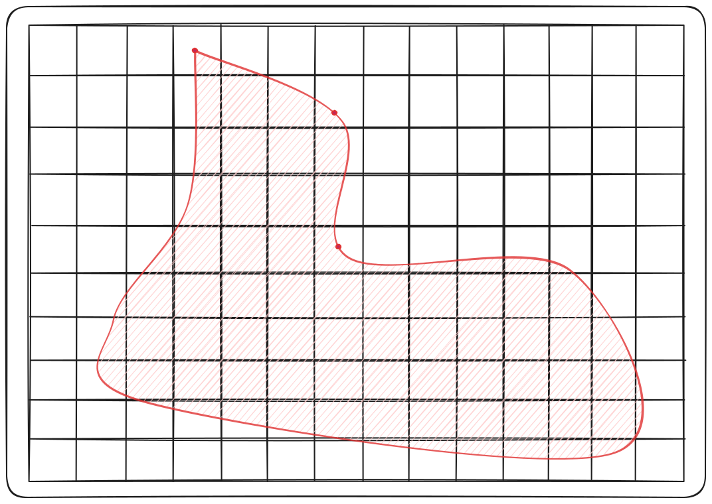

# honeycomb-kernels - GRISUBAL

---

**Grisubal** is a mesh generation algorithm inspired by [Morph][IMR-RN]. The mesh is built by capturing
the input geometry in an overlapping grid, by first computing intersection vertices and then rebuilding
boundaries from the captured vertices.

The algorithm can be called using [this](../honeycomb_kernels/grisubal/fn.grisubal.html) function.

[IMR-RN]: https://internationalmeshingroundtable.com/assets/research-notes/imr32/2011.pdf

---

## Input

The algorithm expects a (2D) geometry specified via a path to a VTK legacy file. The geometry's boundaries should be
described via segments & vertices; Segments should be *consistently oriented*.

<figure style="text-align:center">
    
    <figcaption><i>Finely segmented input geometry</i></figcaption>
</figure>

Some vertices can be explicitly listed as cells in order for the algorithm to interpret those as *Points of Interests*.
This can be used to ensure irregular geometries are captured correctly by the algorithm, which uses a uniform grid size.

## Algorithm

### Step 1 - Intersect Grid & Geometry

#### Overview

The goal of this step is to edit and complete the segment list to obtain a list of non-dividable segments that can be
used for reconstruction at a later step. Consider the previous geometry, submerged in an overlapping grid:

<figure style="text-align:center">
    
    <figcaption><i>Input geometry with its overlapping grid</i></figcaption>
</figure>

We check each segment of the geometry for intersection(s) with the grid, and replace the original segment with new
ones given the result of the check. A [dedicated section](#intersection-computation) goes over the method we use,
these are the rough cases:

- **Both vertices belong to the same cell**: the new segment is the same as the original.
- **Vertices belong to neighboring cells**: there are two new segments, first from start vertex to intersection, second
  from intersection to end vertex.
- **Vertices belong to different non-neighboring cells**: there are *d* new segments, first from start vertex to
  intersection, then between intersections, last from intersection to end vertex.

At the same time, vertices are labeled as one of three types: `Regular`, `PoI`, or `Intersec`. This is used by the
processing logic of the next step.

Note that intersection vertices are currently inserted into the map at this step, while points of interest are
inserted in the map at the next step.

### Step 2 - Filter & Rebuild Segment Data

Given the list of segments computed during the previous step, we must rebuild new segments where both ends are either
points of interest or intersections. This corresponds to building segments using the following vertices:

<figure style="text-align:center">
    
    <figcaption><i>Intersection vertices (gray) & points of interest (red)</i></figcaption>
</figure>

This can be done in two substeps:

1. Filter segments by starting vertex to only keep intersections;
2. For each of these segments, follow through until landing on another intersection; While searching through, keep
   track of any PoI encountered.

Using a set of data made up of starting intersection, ending intersection, and (optional) intermediates, we can build
edges into the final 2-map.

### Step 3 - Insert Segments

#### Overview

Given the data built up at the last step, we can proceed with insertion into the map. At this point, only darts linking
the first intersection to the following vertex need to be added to the map.

The main work consist of fetching correct dart identifiers and update the topology by using link and sew methods. By
following this process recursively for intermediates, we can build the final map, capturing the geometry's boundaries:

<figure style="text-align:center">
    
    <figcaption><i>Captured geometry</i></figcaption>
</figure>

## Appendices

### Intersection Computation

Consider a given segment of the geometry. Each of the segment follow one of three cases:

<figure style="text-align:center">
    
    <figcaption><i>Intersection types</i></figcaption>
</figure>

- `A` - Vertices belong to neighboring cells.
- `B` - Vertices belong to different non-neighboring cells.
- `C` - Both vertices belong to the same cell.

### Insertion Logic