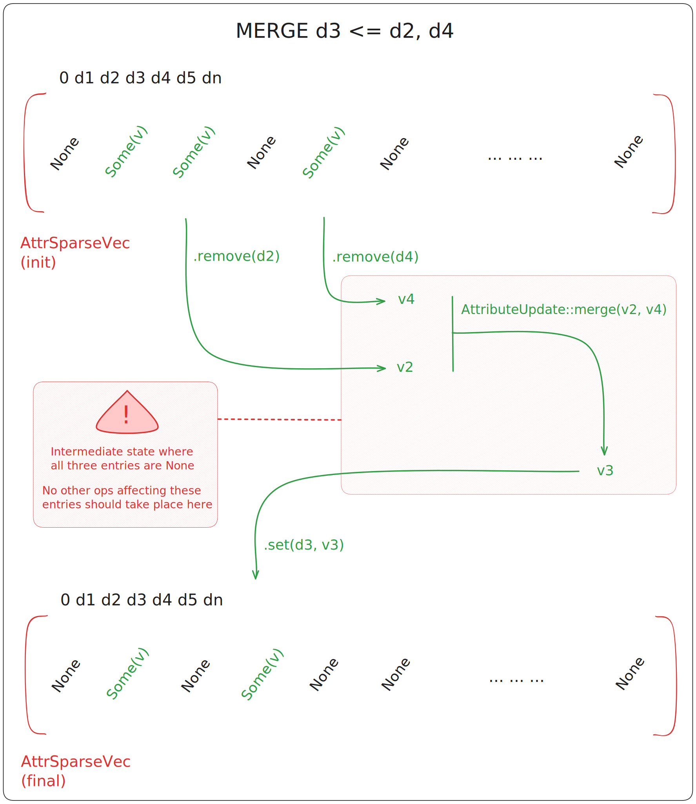

# Using maps in concurrent / parallel contexts

---

## Needs

Rust's ownership semantics require us to add synchronization mechanism to our structure if we want
to use it in concurrent contexts. Using primitives such as atomics and mutexes would be enough to
get programs to compile, but it would yield an incorrect implementation with undefined behaviors.

This is due to the complexity of operations defined on a map, often comprising multiple steps.
For example, the following operation is executed on all affected attributes of a sew:

<figure style="text-align:center">
    
    <figcaption><i>Attribute merging operation. This occurs at each sew operation.</i></figcaption>
</figure>

Because the map can go through invalid intermediate states during a single operation, we need to
ensure another thread will not use one of these as the starting point for another operation.

## Software Transactional Memory

We choose to use Software Transactional Memory (STM) to handle high-level synchronization of
the structure. 

Note that while synchronization could possibly be enforced using aggressive lock strategies, STM
has much better composability and allows users of the crate to define "atomic" segments in their
own algorithms.

Exposing an API that allows users to handle synchronization also means that the implementation
isn't bound to a given parallelization framework. Instead of relying on predefinite parallel
routines (e.g. a provided `parallel_for` on given cells), the structure can integrate seemlessly
in existing algorithm. 


## Examples

To illustrate all of this, we provide two examples: one using `rayon`, and the other using
`std::thread` items. The former focus exclusively on avoiding conflicts while the latter includes
transactions fallible due to operation errors.


### Move all vertices to the average of their neighbors

In the following routine, we shift each vertex that's not on a boundary to the average of its
neighbors posisitions. In this case, transactions allow us to ensure we won't compute a new
position from a value that has been replaced since the start of the computation.


#### Code

```rust
use rayon::prelude::*;

use honeycomb::core::stm::atomically;
use honeycomb::prelude::{
    CMap2, CMapBuilder, DartIdType, OrbitPolicy, Vertex2, VertexIdType, NULL_DART_ID,
};

const DIM_GRID: usize = 256;
const N_ROUNDS: usize = 100;

fn main() {
    // generate a simple grid as input
    let map: CMap2<_> = CMapBuilder::<2, f64>::unit_grid(DIM_GRID).build().unwrap();

    // build a node list from vertices that are not on the boundary
    let tmp: Vec<(VertexIdType, Vec<VertexIdType>)> = map
        .iter_vertices()
        .filter_map(|v| {
            // the condition detects if we're on the boundary
            if map.orbit(OrbitPolicy::Vertex, v as DartIdType)
                .any(|d| map.beta::<2>(d) == NULL_DART_ID)
            {
                None
            } else {
                // the orbit transformation yields neighbor IDs
                Some((
                    v,
                    map.orbit(OrbitPolicy::Vertex, v as DartIdType)
                        .map(|d| map.vertex_id(map.beta::<2>(d)))
                        .collect(),
                ))
            }
        })
        .collect();

    // main loop
    let mut round = 0;
    loop {
        // process nodes in parallel
        tmp.par_iter().for_each(|(vid, neigh)| {
            // we need a transaction here to avoid UBs, since there's
            // no guarantee we won't process neighbor nodes concurrently
            atomically(|trans| {
                let mut new_val = Vertex2::default();
                for v in neigh {
                    let vertex = map.read_vertex(trans, *v)?.unwrap();
                    new_val.0 += vertex.0;
                    new_val.1 += vertex.1;
                }
                new_val.0 /= neigh.len() as f64;
                new_val.1 /= neigh.len() as f64;
                map.write_vertex(trans, *vid, new_val)
            });
            // the transaction will ensure that we do not validate an operation
            // where inputs changed due to instruction interleaving between threads
            // here, it will retry the transaction until it can be validated
        });

        round += 1;
        if round >= N_ROUNDS {
            break;
        }
    }

    std::hint::black_box(map);
}
```


#### Breakdown

The main map structure, `CMap2`, can be edited in parallel using transactions to ensure algorithm
correctness.

In the main computation loop, we use a transaction to ensure each new vertex value is computed from
the current neighbor's values. The errors generated by `read_vertex` and `write_vertex` are used to
(early) detect any changes to the data used in the transaction, here, the list of `neigh` vertices.

At the end of the transaction block, the commit routine will check again if any used data has been
altered. If not, results of the transaction will be validated and written to memory.

### Cut all squares of a grid into triangles

In the following routine, we generate an orthogonal grid and split all of its cells diagonally.
While no beta values should be edited concurrently, synchronization is necessary to protect the
integrity of *I*-cells and their bound attributes (here, spatial coordinates).

#### Code

```rust
use honeycomb::core::stm::atomically_with_err;
use honeycomb::prelude::{CMap2, CMapBuilder, DartIdType};

const DIM_GRID: usize = 256;
const N_THREADS: usize = 8;

fn main() {
    let mut map: CMap2<_> = CMapBuilder::<2, f64>::unit_grid(DIM_GRID).build().unwrap();

    // build individual work units
    let faces = map.iter_faces().collect::<Vec<_>>();
    let nd = map.add_free_darts(faces.len() * 2);
    let nd_range = (nd..nd + (faces.len() * 2) as DartIdType).collect::<Vec<_>>();
    let units = faces
        .into_iter()
        .zip(nd_range.chunks(2))
        .collect::<Vec<_>>();

    std::thread::scope(|s| {
        // create batches & move a copy to dispatched thread
        let batches = units.chunks(1 + units.len() / N_THREADS);
        for b in batches {
            s.spawn(|| {
                let locb = b.to_vec();
                locb.into_iter().for_each(|(df, sl)| {
                    let square = df as DartIdType;
                    let &[dsplit1, dsplit2] = sl else {
                        unreachable!()
                    };
                    // we know dart numbering since we constructed a regular grid
                    let (ddown, dright, dup, dleft) = (square, square + 1, square + 2, square + 3);
                    let (dbefore1, dbefore2, dafter1, dafter2) = (ddown, dup, dleft, dright);

                    let _ = map.force_link::<2>(dsplit1, dsplit2); // infallible

                    // internal operations can fail, so we retry until success
                    while atomically_with_err(|trans| {
                        map.unsew::<1>(trans, dbefore1)?;
                        map.unsew::<1>(trans, dbefore2)?;
                        map.sew::<1>(trans, dsplit1, dafter1)?;
                        map.sew::<1>(trans, dsplit2, dafter2)?;

                        map.sew::<1>(trans, dbefore1, dsplit1)?;
                        map.sew::<1>(trans, dbefore2, dsplit2)?;
                        Ok(())
                    })
                    .is_err()
                    {}
                });
            });
        }
    });

    std::hint::black_box(map);
}
```

#### Breakdown

In this example, we create batches of work for each thread to process. The exact reason we require
transactions here is due to STM implementation specificities. While some STM algorithms fully
prevent operating on invalid data, others will not detect this until there is an attempt to commit
the transaction. The implementation we use is among the latter.

This implies that, if conflicting operations are executed concurrently, any check for invariants
we do in our algorithm can fail due to an inconsistent data state. Practically, we can simply
use a fallible transaction (that's `atomically_with_err`) to define our atomic segment, and handle
the error like any other.

In the above example, transactions are retried until success, since we can guarantee that only
valid data states are commited; that implies transactions will eventually succeed, albeit after
many retries.
